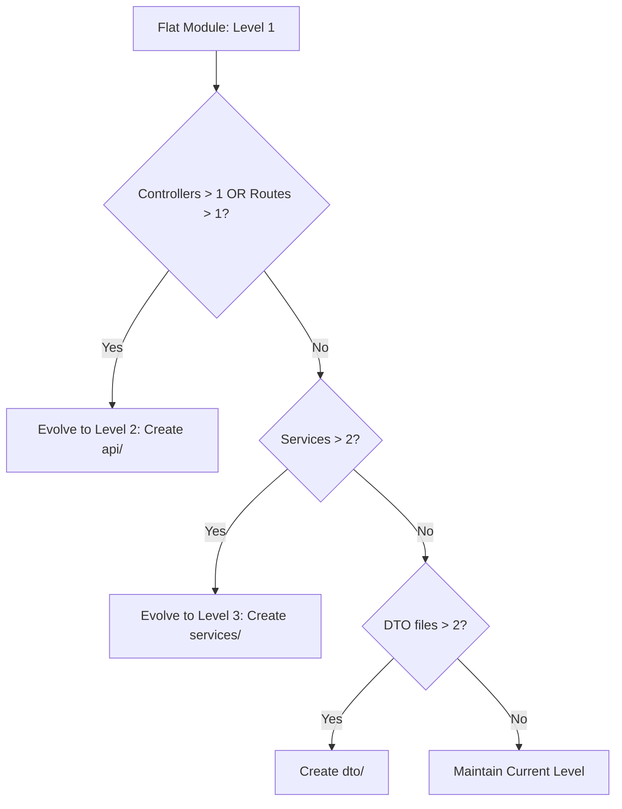

# Backend Architecture Standard v1.0

This document defines the official, mandatory backend architecture standards for the NexusBid project. It serves as the primary engineering reference for all developers, reviewers, and AI coding agents contributing to this codebase. 

---

## 1. Executive Summary

This architecture review evaluates the NexusBid backend codebase, identifying structural patterns, architectural drift, design strengths, critical weaknesses, and operational risks. 

### Current Architecture Overview
The NexusBid backend is structured as a **Hybrid Modular Monolith** written in TypeScript. It is built on Express for routing/HTTP delivery and TypeORM for database persistence (PostgreSQL). Core business logic is contained within feature modules in `src/modules/`, supported by shared utility layers (`src/utils/`), global cross-cutting services (`src/services/`), config layers (`src/config/`), and domain entities (`src/entities/`).

### Architecture Maturity Assessment
The codebase is currently at **Level 2 (Structured but Drifting)** on the architectural maturity scale. While it separates concerns through distinct routing, controller, service, and database entity layers, it suffers from inconsistencies in folder structuring, redundant sources of truth, and fragmented implementation of cross-cutting concerns (specifically caching and RBAC).

### Key Strengths
- **Decoupled Data Schema**: A dedicated `src/entities/` directory isolates TypeORM entity models from business services, allowing database schemas to remain independent of business logic layers.
- **Robust Cross-Cutting Foundations**: Middlewares like `errorHandler.ts`, `rateLimits.ts`, and `traceContext.ts` provide solid request handling baselines.
- **Centralized Registry Concept**: The `src/authorization/registry/` directory represents a forward-thinking design for managing permission hierarchies and dependency graphs.

### Critical Weaknesses
- **Folder Structure Inconsistency**: Feature modules range from completely flat (e.g., `auth/`, `admin/`) to heavily nested (e.g., `analytics/`, `audit/`), creating architectural confusion.
- **Permission Configuration Duplication**: Domain permissions are defined in two separate places (`src/authorization/registry/modules/` and `src/database/seed/permissions/`), creating high drift risk.
- **Caching Fragmentation**: Cache logic is split between `src/cache/`, `src/services/cache.service.ts`, and local module directories (`src/modules/analytics/cache/`).

### Biggest Operational Risks
- **Data & Configuration Inconsistency**: A mismatch between seed permission files and registry definitions can result in runtime authorization failures (denial of service for legitimate users or privilege escalation).
- **Import Cycle Regressions**: The lack of enforced layer boundaries (e.g. Service-to-Service imports) makes the application prone to circular dependencies, which TypeORM and the Express runtime can fail to resolve on startup.
- **Cache Invalidation Failures**: Having three separate caching systems with different TTLs and providers increases the risk of split-brain cache issues and stale database read states.

---

## 2. Architecture Style

The NexusBid backend is a **Hybrid Modular Monolith**. It exhibits the following architectural styles:

```
[ HTTP/Express Clients ]
          │
          ▼
   [ src/middleware ] (Auth, Rate Limits, Audit)
          │
          ▼
   [ src/modules ] (Feature-First Modules: e.g. Tenders, Auth, Support)
     ├── API/Routing/Controllers
     └── Services/Business Logic
          │
          ▼
   [ src/services ] (Shared Utilities & Providers: Email, S3, Cache)
          │
          ▼
   [ src/entities ] (TypeORM Domain Models)
          │
          ▼
    [ PostgreSQL ]
```

### Classification Details
1. **Feature-First Organization (Top-Level Modules)**: Code in `src/modules/` is grouped primarily by domain feature areas (e.g., `tenders`, `auth`, `subscriptions`). This keeps related controllers, routes, DTOs, and services in close proximity.
2. **Layered Architecture (Internal Modules & Infrastructure)**: Inside each module, and across the shared source directory, the system follows a layered pattern (Routes -> Controllers -> Services -> Repositories -> Entities). 
3. **Shared Infrastructure Services**: Generic, business-agnostic capabilities are isolated into a top-level `src/services/` layer (e.g., S3 storage, Email dispatch) and consumed across multiple feature modules.

---

## 3. Architecture Principles

Every contribution to this codebase must adhere to the following architectural principles:

* **Explicit Domain Ownership**: Every feature module must own its domain boundaries. Cross-module communications should be handled through event dispatchers or dedicated coordinator services, never by direct mutation of another module's internal state.
* **Separation of Delivery and Domain Logic**: Controllers and Routes are responsible for the delivery mechanism (HTTP status codes, Express req/res handling, payload validation). They must not contain business rules. Business logic belongs exclusively inside Service layers.
* **Single Source of Truth (SSOT)**: Domain definitions, metadata configuration, and permission hierarchies must be defined in exactly one place. If code generation or synchronization is required (e.g., seeding DB from registry), it must be automated via build-time or startup scripts.
* **Unidirectional Layer Boundaries**: Dependencies must flow inwards. Higher-level layers (e.g., routes and controllers) can import from lower-level layers (e.g., services and repositories), but repositories and services must never import controllers, routes, or Express request/response objects.
* **Interface-Based Integration for Infrastructure**: Services that integrate with external systems (e.g., Redis, S3, Email providers) must expose abstract interfaces. This isolates the application from vendor changes and allows mock implementations during local testing.

---

## 4. Top-Level Folder Standards

The following table defines the purpose, ownership, and boundaries of all directories under `src/`:

| Folder Path | Purpose | Domain Owner | Allowed Contents | Forbidden Contents |
| :--- | :--- | :--- | :--- | :--- |
| `src/authorization/` | Static permission registry and dependency graph validators. | Security / Platform | Permission definition schemas, graph query engines, registry validators. | Database seeds, HTTP controllers, Express middleware definitions. |
| `src/cache/` | Cache providers (Redis, Valkey, Memory) and cache key factories. | Platform | Provider implementations, key factories, caching interfaces. | Business logic, direct DB queries, Express controllers. |
| `src/config/` | System configuration initialization and environment parsing. | Platform | Env parsers (`env.ts`), database configurations, logger init, rbac init. | API routes, controller classes, business logic services. |
| `src/core/` | Global base errors, async request helpers, constants. | Platform | Global custom exception types, common HTTP constants. | Feature-specific business rules, database connection pools. |
| `src/database/` | Database migrations, seeding configurations, database seeds. | Database / Platform | Seed scripts, type definitions for seeds, TypeORM migration files. | Business controllers, services, UI templates. |
| `src/entities/` | TypeORM database models defining the schema. | Database | Entity class files, relations, ORM column mappings. | HTTP request parsers, route handlers, service layer logic. |
| `src/jobs/` | Background crons and recurring jobs managed by the cron worker. | Platform | Cron job managers, file scanning jobs, cleanup cron scripts. | Controllers, direct route files, Express router setup. |
| `src/middleware/` | Express middleware for cross-cutting request concerns. | Platform | Authentication middleware, rate limiters, audit logging, CORS. | Core business services, TypeORM schemas. |
| `src/modules/` | Feature modules containing domain-specific code. | Respective Feature Team | Routes, controllers, services, DTOs, domain helpers. | Core platform middleware, direct external SDK initialization. |
| `src/search/` | Full-text and metadata search engine configurations. | Platform | Search query builders, indexing strategies, search utilities. | HTTP routes, entity schemas, raw SQL migrations. |
| `src/services/` | Shared infrastructure integrations and platform-wide services. | Platform | S3 storage service, email sender, core token service. | Controllers, Express router definitions, route validation schemas. |
| `src/types/` | Global TypeScript type declarations and declaration merging. | Platform | Global type extensions (e.g., `express.d.ts`), global enums. | Executable Javascript code, entity classes, services. |
| `src/utils/` | Low-level stateless helper functions. | Platform | Math builders, slug generators, state-independent parsers. | Services calling DB/network, TypeORM repository imports. |

---

## 5. Feature Module Standard

To ensure consistency across the Modular Monolith, feature modules under `src/modules/` must evolve according to a structured multi-level paradigm. Wrapper folders that contain only a single file are forbidden. Folders must only exist when complexity justifies them.

### Evolution Levels

#### Level 1: Flat (Simple Module)
Used when a feature has limited scope (e.g., 1 controller, 1 service, 1 route file, and 1 DTO file). All files live at the root of the module folder.
```
src/modules/support/
├── support.controller.ts
├── support.dto.ts
├── support.routes.ts
└── support.service.ts
```

#### Level 2: Segmented DTOs/API (Medium Module)
When a module contains multiple endpoints, or payload schemas grow, create a dedicated `dto/` folder. Routes and controllers remain at the root of the module.
```
src/modules/notifications/
├── api/
│   ├── notifications.controller.ts
│   └── notifications.routes.ts
├── dto/
│   └── notifications.dto.ts
└── services/
    └── notifications.service.ts
```

#### Level 3: Fully Layered (Complex Module)
When the module grows to support multiple controllers, services, or background tasks. Core layers are separated into `api/`, `services/`, and `dto/` subdirectories.
```
src/modules/audit/
├── api/
│   ├── audit.controller.ts
│   └── audit.routes.ts
├── dto/
│   └── audit.dto.ts
├── services/
│   └── audit.service.ts
└── utils/
    └── redaction.ts
```

#### Level 4: Complete Domain Subdivision (Enterprise Module)
When a module manages complex infrastructure sub-components (such as dedicated event systems, formulas, or localized caching engines).
```
src/modules/analytics/
├── api/
│   ├── analytics.controller.ts
│   └── analytics.routes.ts
├── cache/
│   └── redis.ts
├── dto/
│   └── analytics.dto.ts
├── events/
│   └── dispatcher.ts
├── jobs/
│   ├── export.job.ts
│   └── rollup.job.ts
├── metrics/
│   └── formulas.ts
├── reports/
│   └── reports.job.ts
└── services/
    └── analytics.service.ts
```

---

## 6. Module Evolution Rules

To remove subjective decisions regarding folder organization, modules must be evolved based on the following deterministic thresholds:



### Hard Threshold Rules

1. **API Layer Separation (`api/`)**:
   - **Rule**: If a module contains more than 1 controller file OR more than 1 routes file.
   - **Action**: Move all controllers and routes into a sub-folder named `api/`.
2. **Service Layer Separation (`services/`)**:
   - **Rule**: If a module contains more than 2 distinct service files (excluding third-party integration layers).
   - **Action**: Move all service files into a sub-folder named `services/`.
3. **Data Transfer Object Separation (`dto/`)**:
   - **Rule**: If the module has more than 2 distinct DTO files or validation schema files.
   - **Action**: Move all DTO files into a sub-folder named `dto/`.
4. **Local Infrastructure Isolation (`jobs/`, `cache/`, `events/`)**:
   - **Rule**: If a module introduces a background job, event dispatcher, or specific cache adapter that is *only* consumed by that module.
   - **Action**: Place it in a dedicated folder inside the module (e.g. `jobs/`, `events/`, `cache/`). If it is consumed by *any other* module, it must be moved to global shared infrastructure (e.g., `src/jobs/` or `src/cache/`).

---

## 7. Dependency Rules

To prevent architectural regression, the NexusBid backend enforces strict unidirectional dependency flow.

```
[Express Routes] 
       │
       ▼
[Controllers / DTO Validation]
       │
       ▼
[Service Layer] (Business Logic)
       │
       ▼
[Repository Layer] (Data Mapper Queries)
       │
       ▼
[TypeORM Entities]
```

### Allowed Dependencies
- **Routes** may depend on **Controllers** and **Middlewares**.
- **Controllers** may depend on **Services** and **DTOs**.
- **Services** may depend on **Repositories**, other **Services** (via interface/orchestrator only), **Entities**, and **Shared Infrastructure** (e.g., Cache, Mailer).
- **Repositories** may depend on **Entities**.

### Forbidden Dependencies
* **No Controller-to-Controller Imports**: Controllers must never import or execute methods from other controllers.
* **No Controller/Route Imports in Services**: Services must be delivery-agnostic. They cannot import Express `Request`, `Response`, or `NextFunction` objects.
* **No Bidirectional Feature Imports**: Feature service `A` must not import feature service `B` directly if service `B` also imports service `A`. 
  - *Mitigation*: Introduce a coordinator/facade service in a parent domain or use **Domain Events** (via `src/utils/domainEvents.ts`) to decouple the interaction.
* **No Module-to-Entity Circular Dependencies**: Database Entities must never import Services or Repositories. Entities are data schemas, not active records.

---

## 8. Shared Infrastructure

Shared infrastructure represents generic capabilities consumed across multiple domain features.

### Shared Infrastructure Responsibilities
- `src/services/`: Generic integrations with external systems (e.g., S3 client, SMTP mail client).
- `src/cache/`: Generic cache providers (Valkey, Memory, Redis) implementing the `CacheProvider` interface.
- `src/authorization/`: The core registry validating that the system permissions configuration is sound.
- `src/middleware/`: Global HTTP pipeline tasks (security headers, error handling, rate limiting).
- `src/jobs/`: Global orchestration of scheduled jobs via a cron scheduler.

### Boundary Rules
- **Infrastructure Promotion**: If a feature module writes an integration (e.g. a specific PDF parser or SMS sender) that is subsequently needed by a second module, it **must** be extracted from the feature module and promoted to `src/services/` or `src/utils/`.
- **Infrastructure Isolation**: Shared infrastructure must *never* import from feature modules. If a shared service requires feature data, it must accept it as parameters or generic types, rather than importing feature services or controller definitions.

---

## 9. Cross-Cutting Concerns

Cross-cutting concerns are handled uniformly through dedicated global systems.

```
┌─────────────────────────────────────────────────────────────┐
│                      Express Pipeline                       │
│  [Rate Limits] ──► [Trace Context] ──► [JWT Auth] ──► [Audit]│
└──────────────────────────────┬──────────────────────────────┘
                               │
                               ▼
┌─────────────────────────────────────────────────────────────┐
│                    Business Service Layer                   │
│        [AppError] ──► [domainEvents] ──► [CacheProvider]    │
└─────────────────────────────────────────────────────────────┘
```

* **Authentication**: Executed in Express pipeline via `src/middleware/authenticate.ts`. Decodes JWT payloads and attaches the user session context to the Express `req.user`.
* **Authorization**: Managed via `src/middleware/authorize.ts` and `src/middleware/permissions.ts`. It queries the permission graph engine (`src/authorization/registry/`) to validate if a user's role has the required authorization.
* **Caching**: Features needing caching must consume `CacheProvider` from `src/cache/`. They must not instantiate Redis or memory cache pools independently.
* **Logging**: Done exclusively via the unified Pino logger in `src/config/logger.ts`. Avoid raw console outputs.
* **Configuration**: Handled strictly through `src/config/env.ts` which performs schema validation on startup. No raw `process.env` calls are allowed inside services or controllers.
* **Validation**: Request payloads must be validated at the controller boundary using DTO classes and the validator middleware (`src/middleware/validate.ts`).
* **Background Jobs**: Orchestrated globally by `CronManager` in `src/jobs/CronManager.ts`. Jobs must be registered in the manager, executing with tracing contexts.
* **Domain Events**: Dispatched asynchronously via `src/utils/domainEvents.ts` to allow side-effects (such as audit trails or notifications) without coupling primary workflows.
* **Error Handling**: Standardized via `src/core/AppError.ts`. The Express error handler middleware (`src/middleware/errorHandler.ts`) catches exceptions, logs stack traces, and returns clean, uniform JSON error structures.

---

## 10. Utility Rules

The `src/utils/` folder contains pure, stateless helper functions.

### Utility Acceptance Criteria
To reside in `src/utils/`, a file must:
1. **Be Stateless**: It must not hold local state, connect to servers, or initialize configurations.
2. **Be Side-Effect Free**: Calling a function in `utils/` with input `A` must always return output `B` without writing to databases, logging to files, or sending network packets.
3. **Be Feature-Agnostic**: It must provide general functions (e.g. date math, slug generation, parsing primitives) rather than domain business rules.

### Forbidden in `src/utils/`
- Direct database repository imports or queries.
- Instantiations of Express routers or Express request/response middlewares.
- Business model services or controller dependencies.

---

## 11. Test Strategy

The NexusBid project adopts a **Centralized Testing Architecture** (under `tests/`).

### Recommended Standard: Centralized Test Directory
```
tests/
├── admin/
├── auth/
├── helpers/
│   ├── builders.ts
│   ├── csrf.ts
│   └── db.ts
├── jest.config.ts
└── ...
```

### Rationale & Trade-Offs

| Test Strategy | Pros | Cons |
| :--- | :--- | :--- |
| **Centralized** *(Current Standard)* | - Keeps build outputs clean from non-production code.<br>- Isolates end-to-end and integration setups in one place.<br>- Simplifies Jest configuration scoping. | - Developers must navigate between two distinct directory roots (`src/` vs `tests/`) to write tests.<br>- Less visible test coverage. |
| **Colocated** | - Instant visibility of test coverage next to the file.<br>- Easier to import local private test helpers. | - pollutes the `src/` directory tree.<br>- Requires complex build configuration exclusions to avoid shipping test files in the production bundle. |

**Decision**: Maintain the **Centralized tests/** directory as the official standard to preserve clean production build outputs.

### Test Construction Standards
- **Integration & End-to-End Tests**: Must run against a clean database instance. Use the helpers in `tests/helpers/db.ts` to clear and migrate the schema between suites.
- **Test Fixtures & Builders**: Use factories in `tests/helpers/builders.ts` to generate mock data. Do not hardcode raw JSON structures inside test cases.

---

## 12. Architecture-Level Naming

To ensure consistency, architecture elements must be named according to their structural role. This complements the internal variable naming standards.

* **Controller**: Suffix with `Controller` (e.g., `RbacRoleController`). Responsible for handling HTTP delivery, input validation mapping, and status codes.
* **Service**: Suffix with `Service` (e.g., `TenderWorkflowService`). Contains core business logic, domain assertions, and transaction scripting.
* **Repository**: Suffix with `Repository` (e.g., `subscriptionRepository`). Handles database query isolation and TypeORM queries.
* **Provider**: Suffix with `Provider` (e.g., `RedisCacheProvider`). Implements low-level infrastructure adapters for interchangeable systems.
* **Middleware**: CamelCase with descriptive intent (e.g., `auditLogger`, `authenticate`). An Express request-response interceptor.
* **Job**: Suffix with `.job` in file name (e.g., `virusScanning.job.ts`). Executable unit of work scheduled by the background runner.
* **Event**: Suffix with `Events` or `Event` (e.g., `RbacEvents`). Defines payload interfaces and emitter triggers for domain events.
* **Registry**: Suffix with `Registry` (e.g., `PermissionRegistry`). Manages static metadata registers and system permission maps.

---

## 13. Decision Matrix

Use the following lookup table to determine the exact folder destination when adding or modifying codebase files:

| If you are adding/modifying... | Target Destination Directory | Architectural Reason |
| :--- | :--- | :--- |
| A new API endpoint route | `src/modules/[feature]/api/` or `src/modules/[feature]/` | Keeps routes close to their domain context. |
| Business transaction logic | `src/modules/[feature]/services/` or `src/modules/[feature]/` | Service layers act as the boundary for transaction scripts. |
| Database entity mappings | `src/entities/` | Centralizes database schemas for clear type safety and migrations. |
| A background cron worker job | `src/jobs/` | Centralizes scheduled tasks for execution monitoring. |
| An Express request filter | `src/middleware/` | Pipeline request interception is a system-wide cross-cutting concern. |
| A database seed config | `src/database/seed/` | Keeps seed definitions together for database setup commands. |
| Static permission metadata | `src/authorization/registry/` | Permission registration must reside in the static engine boundary. |
| A mock external client | `src/services/mock/` | Centralizes test doubles for mock integrations. |
| Custom Express request types | `src/types/` | Allows declaration merging across Express typing definitions. |
| Environment config schemas | `src/config/` | Ensures config values are parsed and validated on server boot. |

---

## 14. Architecture Violations

The following issues represent violations of the `Backend Architecture Standard v1.0`.

### Violation 1: Competing Module Styles (Flat, Layered, Hybrid)
* **Severity**: `Medium`
* **Description**: Feature modules use different organization layouts. For instance, `auth` is completely flat, `analytics` is deeply nested, and `rbac` is hybrid.
* **Impact**: Decreases code discoverability and increases development friction when writing features.
* **Recommendation (REQUIRED)**: Standardize all modules using the **Module Evolution Rules** (defined in Section 6). Evolve flat modules exceeding file counts to Level 2 or 3.
* **Migration Complexity**: Low (safe directory restructuring).
* **Risk Level**: Low.

### Violation 2: High Complexity in Flat Auth Module
* **Severity**: `High`
* **Description**: The `src/modules/auth/` directory contains 8 files covering authentication, OAuth, security checks, and logging.
* **Impact**: Violates cohesion principles, making it difficult to isolate authentication logic from security monitoring logs.
* **Recommendation (REQUIRED)**: Evolve the auth module to **Level 3 (Fully Layered)**. Separate routing/controllers into `api/`, core logics into `services/`, and schemas into `dto/`.
* **Migration Complexity**: Low.
* **Risk Level**: Low.

### Violation 3: Partial RBAC Controller Migration
* **Severity**: `Medium`
* **Description**: Some RBAC controllers are located in `controllers/`, while `rbac.controller.ts` remains at the root of `src/modules/rbac/`.
* **Impact**: Increases cognitive load for developers trying to find endpoint actions.
* **Recommendation (REQUIRED)**: Move `rbac.controller.ts` and `rbac.routes.ts` into the `controllers/` (or `api/`) sub-folder.
* **Migration Complexity**: Low.
* **Risk Level**: Low.

### Violation 4: Duplicate Permission Configuration
* **Severity**: `Critical`
* **Description**: Permission domain schemas are duplicated across `src/authorization/registry/modules/` and `src/database/seed/permissions/`.
* **Impact**: High risk of configuration drift where seed permissions diverge from registry definitions, causing security runtime errors.
* **Recommendation (REQUIRED)**: Consolidate the source of truth into `src/authorization/registry/modules/`. Refactor the seeding scripts to load from this registry directory.
* **Migration Complexity**: Medium (requires refactoring the seeding script logic).
* **Risk Level**: Medium.

### Violation 5: Fragmented Caching Implementation
* **Severity**: `High`
* **Description**: Caching layers exist in `src/cache/`, `src/modules/analytics/cache/`, and `src/services/cache.service.ts`.
* **Impact**: Duplicate cache client instances are created, leading to unnecessary connections, memory overhead, and inconsistent caching behaviors.
* **Recommendation (REQUIRED)**: Standardize on `src/cache/` as the single location for caching infrastructure. Expose providers through `CacheKeyFactory` and `CacheProvider`, and deprecate `cache.service.ts`.
* **Migration Complexity**: Medium.
* **Risk Level**: Medium.

---

## 15. Architecture Scorecard

The project architecture has been rated across the following categories (1-10 scale):

| Category | Score | Remediation Plan |
| :--- | :--- | :--- |
| **Folder Organization** | `6/10` | Standardize top-level directory access boundaries. |
| **Module Consistency** | `5/10` | Reorganize `auth/`, `rbac/`, and `support/` modules according to the Evolution Rules. |
| **Dependency Direction** | `8/10` | Enforce clean unidirectional import restrictions via lint rules. |
| **Separation of Concerns** | `7/10` | Extract database transactions from controllers to service methods. |
| **Feature Isolation** | `7/10` | Remove direct module-to-module dependencies; implement domain event dispatch. |
| **Shared Infrastructure** | `6/10` | Consolidate duplicate caching codebases into the `src/cache/` folder. |
| **Cross-Cutting Concerns** | `8/10` | Middlewares are well-organized, but need consolidation of authorization logic. |
| **Scalability** | `8/10` | Clean entity boundaries make scaling the database layer straightforward. |
| **Test Organization** | `9/10` | Centralized testing structure is consistent and clean. |
| **Technical Debt** | `6/10` | Remediate structural drift and remove duplicate configuration logic. |
| **Overall Maturity** | `7/10` | **Target Score: 9/10** through planned, phased refactoring. |

---

## 16. Migration Strategy

This roadmap details the phased cleanup of the NexusBid backend architecture. Each phase can be executed independently.

```
┌─────────────────────────────────┐
│  Phase 1: Architecture Standard │
└────────────────┬────────────────┘
                 │
                 ▼
┌─────────────────────────────────┐
│    Phase 2: Module Restructure  │
└────────────────┬────────────────┘
                 │
                 ▼
┌─────────────────────────────────┐
│    Phase 3: Permission SSOT     │
└────────────────┬────────────────┘
                 │
                 ▼
┌─────────────────────────────────┐
│     Phase 4: Cache Integration  │
└─────────────────────────────────┘
```

### Phase 1: Architecture Standard Enforcement
- **Goal**: Establish standard boundaries and static rules.
- **Scope**: Commit this standard document and add ESLint import constraints.
- **Risk**: Low.
- **Acceptance Criteria**: standard document is merged; build executes successfully.
- **Rollback Strategy**: Revert standard commits.

### Phase 2: Module Structuring & Evolution Cleanup
- **Goal**: Remediate module organization inconsistencies.
- **Scope**: Reorganize `auth/`, `rbac/`, and `support/` modules according to the levels in Section 5.
- **Risk**: Low.
- **Acceptance Criteria**: All module files follow the defined Level structures.
- **Rollback Strategy**: Revert folder structure modifications.

### Phase 3: Permission Source of Truth Consolidation
- **Goal**: Eliminate duplicate permission definitions.
- **Scope**: Configure `database/seed/permissions/` to load directly from the registry definitions in `authorization/registry/modules/`. Delete the duplicate seeding files.
- **Risk**: Medium (incorrect permission mappings may block admin features).
- **Acceptance Criteria**: `npm run seed` creates permissions in sync with the registry graph.
- **Rollback Strategy**: Restore seeding files from Git history.

### Phase 4: Unified Caching Integration
- **Goal**: Consolidate caching implementations.
- **Scope**: Migrate callers of `cache.service.ts` to `src/cache/` cache providers and deprecate the old service.
- **Risk**: Medium (improper caching could impact production performance).
- **Acceptance Criteria**: Application runs using Valkey/Redis through the core provider; old service is removed.
- **Rollback Strategy**: Revert code integrations to keep using the old service.

---

## 17. AI Development Rules

AI coding agents and developers must adhere to the following rules when modifying the codebase:

1. **Do Not Create New Top-Level Folders**: All source code changes must fit within the existing directory structure under `src/`.
2. **Adhere to Module Evolution Rules**: Before adding a file to a feature module, check if the folder complexity exceeds the thresholds in Section 6. If it does, reorganize the module to the appropriate level.
3. **No Direct Feature-to-Feature Cross-Imports**: Avoid direct service imports between different feature modules. Use domain event emitters (`src/utils/domainEvents.ts`) to decouple modules.
4. **Use Shared Caching Systems**: Do not write custom caching mechanisms. Retrieve cache instances using `src/cache/`.
5. **No Wrapper Folders**: Do not introduce folders containing only one file. Subdirectories must contain multiple files.
6. **No Raw Env Usage**: Never access environment variables via `process.env` directly inside services or controllers. Import variables from the centralized config `src/config/env`.

---

## 18. Final Recommendations

### Recommendation 1: Consolidate Permission Domain Configuration (REQUIRED)
- **Rationale**: Duplicate definition of permissions in registry modules and seeding files introduces a high risk of drift.
- **Expected Benefit**: A single source of truth for all application authorizations, eliminating permission inconsistencies.
- **Trade-offs**: Requires refactoring the seeding scripts to load from registry modules.
- **Migration Impact**: Modifies database initialization commands during deployment.
- **Implementation Risk**: Medium.

### Recommendation 2: Evolve Auth and RBAC Modules (REQUIRED)
- **Rationale**: The flat auth module and hybrid RBAC layouts violate cohesion principles.
- **Expected Benefit**: Improved code organization and discoverability of business logic.
- **Trade-offs**: Requires folder restructuring and import path updates.
- **Migration Impact**: None (purely internal directory organization).
- **Implementation Risk**: Low.

### Recommendation 3: Consolidate Caching Implementations (REQUIRED)
- **Rationale**: Caching logic is scattered across three different locations.
- **Expected Benefit**: Uniform caching behavior, lower memory footprint, and consistent invalidation.
- **Trade-offs**: Requires code refactoring in services using cache mechanisms.
- **Migration Impact**: Cache entries may need to be flushed on deployment.
- **Implementation Risk**: Medium.
